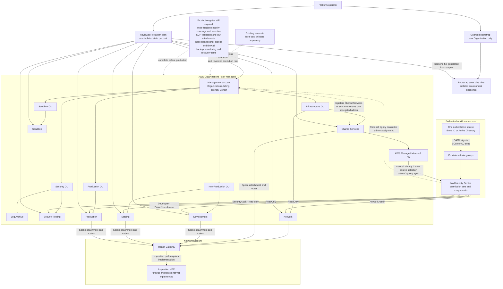

# Self-Managed AWS Organizations Landing Zone

```mermaid
flowchart TB
  Operator["Platform operator"]
  Bootstrap["Guarded bootstrap<br/>new Organization only"]
  Deploy["Reviewed Terraform plan<br/>one isolated state per root"]
  Operator --> Bootstrap
  Operator --> Deploy

  subgraph Org["AWS Organizations - self-managed"]
    Management["Management account<br/>Organizations, billing, Identity Center"]
    SecurityOU["Security OU"]
    InfraOU["Infrastructure OU"]
    ProdOU["Production OU"]
    NonprodOU["Non-Production OU"]
    SandboxOU["Sandbox OU"]
    Management --> SecurityOU
    Management --> InfraOU
    Management --> ProdOU
    Management --> NonprodOU
    Management --> SandboxOU
    SecurityOU --> LogArchive["Log Archive"]
    SecurityOU --> Security["Security Tooling"]
    InfraOU --> Network["Network"]
    InfraOU --> Shared["Shared Services"]
    Shared --> AD["AWS Managed Microsoft AD"]
    ProdOU --> Prod["Production"]
    NonprodOU --> Stage["Staging"]
    NonprodOU --> Dev["Development"]
    SandboxOU --> Sandbox["Sandbox"]
  end

  subgraph Workforce["Federated workforce access"]
    IdP["One authoritative source<br/>Entra ID or Active Directory"]
    Groups["Provisioned role groups"]
    IDC["IAM Identity Center<br/>permission sets and assignments"]
    IdP -->|"SAML sign-in<br/>SCIM or AD sync"| Groups
    Groups --> IDC
  end
  IDC -->|"SecurityAudit - read-only"| Security
  IDC -->|"NetworkAdmin"| Network
  IDC -->|"Developer - PowerUserAccess"| Dev
  IDC -->|"ReadOnly"| Stage
  IDC -->|"ReadOnly"| Prod
  IDC -. "Optional, tightly controlled admin assignment" .-> Management
  Management -. "registers Shared Services as sso.amazonaws.com delegated admin" .-> Shared
  AD -->|"manual Identity Center source selection<br/>then AD group sync"| IDC

  subgraph NetworkHub["Network account"]
    TGW["Transit Gateway"]
    Inspection["Inspection VPC<br/>firewall and routes not yet implemented"]
    Network --> TGW
    TGW -. "inspection path requires implementation" .-> Inspection
  end
  Shared -->|"Spoke attachment and routes"| TGW
  Dev -->|"Spoke attachment and routes"| TGW
  Stage -->|"Spoke attachment and routes"| TGW
  Prod -->|"Spoke attachment and routes"| TGW

  State["Bootstrap state plus nine isolated environment backends"]
  Bootstrap --> State
  Deploy -->|"backend.hcl generated from outputs"| State
  Deploy --> Management
  Deploy --> Security
  Deploy --> Network
  Deploy --> Shared
  Deploy --> Dev
  Deploy --> Stage
  Deploy --> Prod
  Deploy --> Sandbox

  Existing["Existing accounts<br/>invite and onboard separately"]
  Existing -. "AWS Organizations invitation<br/>and reviewed execution role" .-> Org

  Gaps["Production gates still required:<br/>multi-Region security coverage and retention<br/>SCP validation and OU attachments<br/>inspection routing, egress and firewall<br/>backup, monitoring and recovery tests"]
  Gaps -. "complete before production" .-> Org
```
